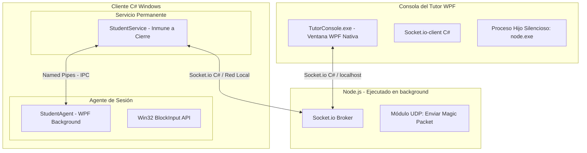

# Plan de Implementación: Sistema CG_Support (Clon de NetSupport School)

Este es el plan de diseño y arquitectura de **CG_Support**, actualizado con la interfaz 100% nativa en C# (WPF) para la Consola del Tutor y el Cliente Estudiante, manteniendo Node.js únicamente como un servidor de comunicaciones en segundo plano sin usar navegadores.

---

## 📌 1. Arquitectura de Sistema 100% C# (WPF) con Broker Node.js

Para cumplir con el requerimiento de que todo el sistema de monitoreo sea en C# nativo y no requiera abrir ningún navegador web, estructuraremos el sistema así:

### A. Consola del Tutor NATIVA (`TutorConsole.exe` - C#/WPF)
- **Interfaz 100% WPF**: La ventana del profesor será una aplicación de escritorio nativa e independiente desarrollada en WPF. No se usará navegador web.
- **Renderizado Nativo**: Las capturas de pantalla de los estudiantes se recibirán como arreglos de bytes (JPEG/WebP) vía Socket.io y se dibujarán directamente en controles `Image` de WPF dentro de una grilla responsiva (`WrapPanel` o `UniformGrid`).
- **Control de Ciclo de Vida**: Al iniciar `TutorConsole.exe`, este levanta silenciosamente el servidor de comunicaciones Node.js (`node.exe server.js`) en segundo plano. Al cerrar la aplicación WPF, el proceso Node.js es terminado inmediatamente de forma limpia.

### B. Broker / Servidor de Mensajería (Node.js en Segundo Plano)
- **Rol Silencioso**: Funciona estrictamente como un servidor de enrutamiento WebSocket y emisor UDP. No tiene interfaz web, no usa navegador y consume el mínimo de recursos.
- **Función**: Recibe las conexiones WebSocket del Tutor y de los Clientes Estudiantes y enruta los flujos de pantalla, eventos de mouse/teclado, comandos de bloqueo y paquetes de encendido remoto (WOL).

### C. Cliente Estudiante (`StudentService` + `StudentAgent.exe` - C#)
- **Servicio de Windows**: Se ejecuta en segundo plano como servicio del sistema (System Level) y es inmune al Administrador de Tareas.
- **Agente de Sesión (WPF)**: Se ejecuta en la sesión de usuario activa para captura de pantalla, intercepción de URLs (UI Automation) y despliegue del bloqueo físico de pantalla (WPF Maximized Topmost con `BlockInput`).

---

## 📂 2. Estructura de Capas e Interacción



---

## ⚙️ 3. Módulos Técnicos y Flujos de Código

### Módulo A: Conexión WebSocket desde C# (Tutor & Estudiante)
Tanto la consola del Tutor como el servicio del Estudiante usarán la librería de NuGet **`SocketIOClient`** para conectarse al servidor Node.js de manera nativa:

```csharp
using SocketIOClient;
using System;
using System.Windows.Media.Imaging;

public class WebSocketClient
{
    private SocketIO client;

    public async void ConnectToServer(string serverUrl)
    {
        client = new SocketIO(serverUrl);

        client.OnConnected += (sender, e) => {
            Console.WriteLine("Conectado al servidor Node.js");
        };

        // Recibir frame de pantalla de un estudiante (Tutor)
        client.On("screen_frame_received", response => {
            var data = response.GetValue<ScreenFrameData>();
            UpdateStudentThumbnail(data.StudentId, data.ImageBytes);
        });

        await client.ConnectAsync();
    }

    private void UpdateStudentThumbnail(string studentId, byte[] imageBytes)
    {
        // Renderizar el byte[] directamente a la UI de WPF de forma asíncrona
        App.Current.Dispatcher.Invoke(() => {
            BitmapImage bitmap = BytesToImage(imageBytes);
            // Actualizar la miniatura del estudiante correspondiente en la grilla WPF
        });
    }

    private BitmapImage BytesToImage(byte[] bytes)
    {
        using (var ms = new System.IO.MemoryStream(bytes))
        {
            var image = new BitmapImage();
            image.BeginInit();
            image.CacheOption = BitmapCacheOption.OnLoad;
            image.StreamSource = ms;
            image.EndInit();
            return image;
        }
    }
}
```

### Módulo B: Captura y Simulación de Control Remoto (C#)
1. **Captura**: Se realiza mediante la API nativa de Windows `GDI` o `DirectX`, se escala en C# y se comprime en JPEG usando `System.Drawing.Imaging`.
2. **Replicación de Inputs**: El Tutor envía coordenadas relativas al tamaño de pantalla del estudiante. El cliente WPF usa `SendInput` para mover el cursor y simular clics.

---

## 📂 4. Organización de Archivos en el Espacio de Trabajo

La estructura de carpetas configurada en tu espacio de trabajo es:
1. **`planes/implementation_plan.md`**: Este plan con los requerimientos técnicos y esquemas.
2. **`planes/README.md`**: Instrucciones del proyecto.

---

## 🚀 5. Siguientes Pasos

Procederemos a:
1. Diseñar el layout nativo de la **Consola del Tutor en WPF** (con grillas uniformes de computadoras, indicadores de estado LED, menú lateral y área de dibujo interactivo).
2. Crear el **servidor de red Node.js** que correrá de manera 100% oculta.
3. Crear los proyectos de Visual Studio para el **Servicio y Agente Estudiante** en C#.
